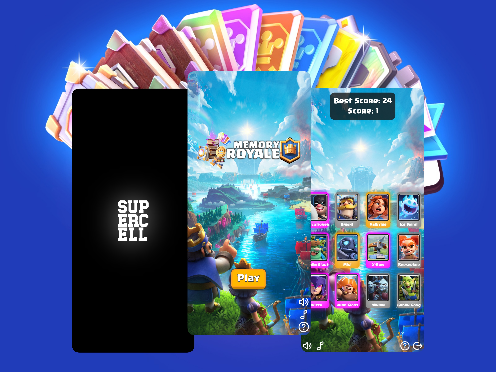

<h1 align='center'>Memory Royale</h1>

   

From Cards to Clashes, Can you remember it all? A Clash Royale themed Memory Game to test your wits!

## Domain

https://memory-royale.vercel.app/

## Features

- Clash Royale themed - Intro, Loading, Home & Game Pages
- Fluid Animations - Interactive Transitions
- Dynamic Layouts - Mobile & Tablet-Friendly
- Immersive Gameplay - Seamless UI
- Clash Royale Sounds - via dev [Henrylq](https://github.com/Henrylq/Clash-Royale-SFX)
- Clash Royale Assets - via [Supercell Fankit](https://fankit.supercell.com/)
- 98 Unique Cards - via [Clash Royale API](https://developer.clashroyale.com/)
- 12 Cards per Round - Refreshed & Randomized
- Accessible Audio - Mute Music and Sounds

## Technologies

## Screenshots

   
   
   
   

## Credits

This game is a **Personal Project** that was built with the aim to develop and showcase my Web-Development skills. It is not affiliated with, endorsed, sponsored, or specifically approved by Supercell. All game assets, including images, sounds, and other intellectual property, are the sole property of Supercell. For more information, please refer to [Supercell's Fan Content Policy](https://supercell.com/en/fan-content-policy/).

## Audio Guidelines

The audio in the app at the start may be muted by default and none will be heard until after a user interaction occurs. This is due to [Chrome's Audio Accessibility Guidelines](https://developer.chrome.com/blog/autoplay/). For a complete audio experience, please unmute music and sounds using their respective buttons and explore all pages of the game.

## Project Plan

For a detailed thought process and planning behind building this project, please refer to the [Project Plan Document](./project-plan.md).
